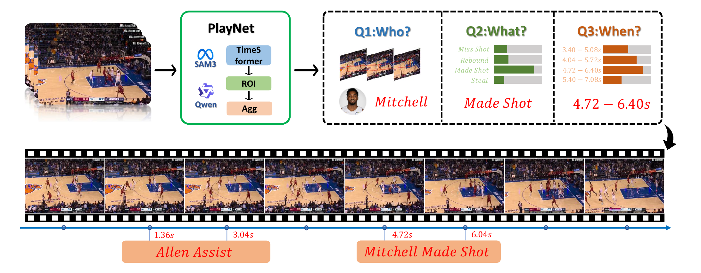

# BasketEvent

BasketEvent is an automatic player-level event-recognition project for basketball game
videos. Starting from raw broadcast videos, it first uses SAM3 for open-vocabulary
segmentation and tracking of players and the ball, then uses Qwen2.5-VL to clean
the tracking results, identify valid players, and select the real ball trajectory.
Finally, a TimeSformer-based model predicts player-level
basketball events.

The project implements the following functions:

- Track on-court players and ball candidates from basketball videos.
- Filter invalid tracks such as referees, audience members, bench players, staff,
  and false detections.
- Map valid player tracks to real player names using jersey color, jersey number,
  and roster information.
- Predict player-level events using video clips, player bounding boxes, and ball
  bounding boxes.
- Support training, evaluation, and single-video inference.


## 1. Quickstart

### 1.1 Environment Setup

SAM3 recommends Python 3.12, PyTorch 2.7, and CUDA 12.6. All Python
dependencies are listed in `requirements.txt`.

```bash
cd /path/to/BasketEvent

conda create -n sam3 python=3.12
conda activate sam3

pip install -r requirements.txt
```

If `torchvision.io.read_video` cannot read videos, make sure FFmpeg is installed
on the system.

### 1.2 SAM3 Checkpoint

SAM3 checkpoint:

```bash
hf auth login
huggingface-cli download facebook/sam3
```

URL:

```text
https://huggingface.co/facebook/sam3
```

### 1.3 Qwen2.5-VL Checkpoint

Qwen2.5-VL checkpoint:

```bash
hf auth login
huggingface-cli download Qwen/Qwen2.5-VL-7B-Instruct \
  --local-dir /GPFS/public/Qwen2.5-VL-7B-Instruct
```

URL:

```text
https://huggingface.co/Qwen/Qwen2.5-VL-7B-Instruct
```

`recognize.py` currently expects this local path:


## 2. Data Storage Format

The code organizes videos and annotation files using a two-level
`game_id/video_name` structure. During training and evaluation,
`src/dataset.py` scans `bbox_dir/{game_id}/*.json` and automatically finds the
corresponding video:

```text
video_path = video_dir/{game_id}/{video_name}.mp4
bbox_path  = bbox_dir/{game_id}/{video_name}.json
```

Recommended directory layout:

```text
/DB/data/yuzhang/basketball/
├── videos/
│   └── {game_id}/
│       └── {video_name}.mp4
├── train/
│   └── {game_id}/
│       └── {video_name}.json
├── valid/
│   └── {game_id}/
│       └── {video_name}.json
└── test/
    └── {game_id}/
        └── {video_name}.json
```

Directory meanings:

- `videos/` stores raw basketball game videos.
- `train/`, `valid/`, and `test/` store trajectories and event which are generated by SAM3 and Qwen2.5-VL.

A single trajectory JSON file uses the following format. Bounding boxes are in
`xywh` format:

```json
{
  "player_0": {
    "jersey_number": 23,
    "jersey_color": "white",
    "player_name": "Player Name",
    "trajectory": [[x, y, w, h], null, [x, y, w, h]],
    "event": {
      "actionType": "Made Shot"
    }
  },
  "ball": {
    "trajectory": [[x, y, w, h], null, [x, y, w, h]]
  }
}
```

The training code uses `event.actionType` as the event label. Supported classes
are defined in `src/dataset.py`:

Qwen2.5-VL player recognition requires a roster JSON. Example:

```json
{
  "jersey_color": {
    "Home Team": "white",
    "Away Team": "blue"
  },
  "players": [
    {
      "team_name": "Home Team",
      "jersey": "23",
      "name": "Player Name"
    }
  ]
}
```

## 3. Pipeline Steps

Run the following commands from the `BasketEvent` root directory.

### Step 1: SAM3 Tracking

File: `track_one_video.py`

Purpose: take a raw video as input, use SAM3 with text prompts to track on-court
players and the basketball, and export raw candidate trajectories.

```bash
python track_one_video.py \
  --video_path examples/4712c593-1cd3-fc7f-be55-1b967fadac0f_1280x720.mp4 \
  --json_save_path examples/4712c593-1cd3-fc7f-be55-1b967fadac0f_1280x720_raw.json \
  --gpus_to_use 0
```

Example output:

```text
examples/{video_name}_raw.json
```

### Step 2: Qwen2.5-VL Track Cleaning and Player Identification

File: `recognize.py`

Purpose: read the raw SAM3 JSON, filter invalid player tracks, identify players
using roster information, and select the real ball trajectory from multiple ball
candidates.

```bash
python recognize.py \
  --video_path examples/4712c593-1cd3-fc7f-be55-1b967fadac0f_1280x720.mp4 \
  --bbox_json_path examples/4712c593-1cd3-fc7f-be55-1b967fadac0f_1280x720_raw.json \
  --json_save_path examples/4712c593-1cd3-fc7f-be55-1b967fadac0f_1280x720.json \
  --roster_json /path/to/{game_id}.json \
  --gpus_to_use 0
```

Example output:

```text
examples/{video_name}.json
```

### Step 3: Train the Event Recognition Model

File: `train.py`

Purpose: read cleaned trajectory JSON files and corresponding videos, construct
multi-clip bags, and train `PlayerEventModel`.

We'll provide detailed annotation json files to skip the first two steps. For the test dataset, we manually labeled the relationships between trajectories and events to make sure the data is correct.

```bash
torchrun --nproc_per_node=4 train.py \
  --bbox_dir data/train \
  --video_dir data/videos \
  --cache_dir cache \
  --save_dir ckpt_train \
  --bag_clips 4 \
  --clip_len 8 \
  --fps_in 25 \
  --fps_out 4 \
  --batch_size 1 \
  --epochs 10
```


### Step 4: Evaluate the Model

File: `test.py`

Purpose: evaluate top-k classification accuracy on the test set. When
`event_time_labels.csv` is available, the script can also evaluate temporal
localization-related metrics.

```bash
torchrun --nproc_per_node=4 test.py \
  --ckpt ckpt/epoch_best.pt \
  --test_dir data/test \
  --video_dir data/videos \
  --cache_dir cache \
  --time_csv data/event_time_labels.csv \
  --bag_clips 12 \
  --clip_len 8 \
  --fps_in 25 \
  --fps_out 4
```

### Step 5: Single-Video Inference

File: `inference.py`

Purpose: given one video and its cleaned trajectory JSON, output predicted
player-event pairs whose event class is not `blank`.

```bash
python inference.py \
  --video examples/4712c593-1cd3-fc7f-be55-1b967fadac0f_1280x720.mp4 \
  --traj_json examples/4712c593-1cd3-fc7f-be55-1b967fadac0f_1280x720.json \
  --checkpoint ckpt.pt \
  --bag_clips 12 \
  --clip_len 8 \
  --fps_in 25 \
  --fps_out 4 \
